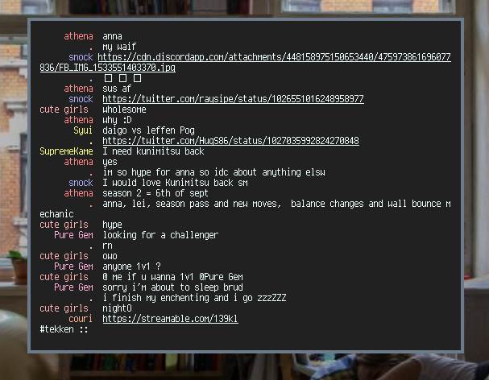
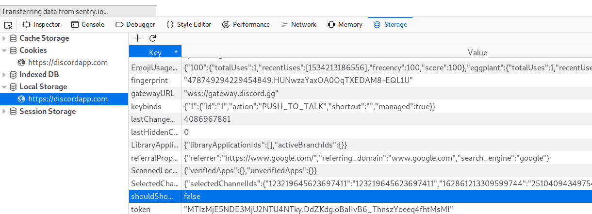

# Terminal-Discord

A simple terminal based client for Discord using the [discord.js](https://discord.js.org) API with a minimal look and UI.

If you have any questions feel free to join this [server](https://discord.gg/uFcg8rD).

**DISCLAIMER** Self-bots and modified/custom clients are against Discord's TOS.
I am not responsible for any loss or restrictions relating to your account that follows from the use of this software.  
Note that bot account clients are a grey zone so you're able to log in as a bot with a bot token, however abuse of the Discord API violates Discord Terms of Service.

## Installation

Install with `npm install -g terminal-discord`

(Note to Linux users: If you run into any permissions errors while trying to install with sudo, follow the steps provided [here](https://github.com/glenpike/npm-g_nosudo)).

## Running on Windows

Windows cannot resolve a path 

## Config-File

The default locations for the config file are ~/.config/terminal-discord or ~/.terminal-discord. It is however also possible to pass a path to a config file like such

\$terminal-discord PATH_TO_CONFIG

All settings except Token are optional. Defaults can be found at the beginning of index.js where the config-file is parsed.

Check the example config in the repository for an example.

### token

Discord has made token retrieval more difficult after recent updates. To find your token you have to navigate to the discord browser site, open the developer tools with ctrl+shift+i or similar and find the local storage as shown in the picture.

Once you reload the page the token will pop up for about a second. Copy it and paste it in the config-file.

### max_name_length

The maximum length of usernames. If the value is null usernames are not cut short.

### allign

Requires max_name_length to be set.  
If this option is set to false the seperators will be displayed right after the username instead of them being alligned with other seperators.

### right_bound

Requires allign to be set to true.  
This option controls whether names are leftbound or rightbound.

### separator

Separator between username and message content.

### history_length

Number of messages loaded at a time. If set to null will fetch as many messages as there are rows in the current terminal window.

### default_guild

If not null this corresponds to the index of the guild you want selected at startup.

### default_channel

If not null this corresponds to the index of the channel you want selected at startup.

To get the indices for both guild and channel navigate to your channel and use the /info command.

### prompt

The prompt used.

`%u` is replaced by your usernmame.

`%d` by your nickname if present otherwise username.

`%c` will be replaced by the channel name.

`%g` is replaced by the guild name.

### color_support

Wether color for usernames is enabled or not.

### default_color

Default color for users without a role. If not set will default to #FFFFFF.

### mention_color

What background color the message should have when you get mentioned. Only applicable when colorsupport is enabled. Setting this to null disables the feature.

### repeat_name

When a user sends multiple messages in a row this controls whether their name should be displayed multiple times or be replaced with a dot.

### use_nickname

Whether the nickname should be displayed when available.

### show_time

Show the timestamp next to a message.

### show_date

Enable date support to display DD.MM.YYYY in front of the time.

### select_count

How many items are displayed per page in a menu.

### block_messages

If set to true messages from blocked users are displayed as `<blocked>`

## Commands

Enter a command while in a channel using /.

**q** or **quit**: exits the client

**u**, **update**, **r**, **refresh**: refresh manually

**nick**: changes your nickname

**d**, **delete**: deletes the last sent message

**e**, **edit**: replaces the content of your last sent message with the string after /e. Pressing tab after "/edit " fills in the previous message

**c**, **channel**: selects a different channel within the same guild

**m**, **menu**: opens the channel selection menu to switch to a different channel

**o**, **online**: shows a list of currently online users

**g**, **gr**, **group**: opens group chat selection menu to switch to a different channel

**dm**, **pm**: opens dm chat selection menu to switch to a different channel

**i**, **info**: displays basic information about the channel including indices

**b**, **block**: toggles display of blocked messages

**h**, **help**: shows help message

Note that edit and delete only work on messages sent in the current session. If you haven't sent a message in the current session the command will do nothing.
